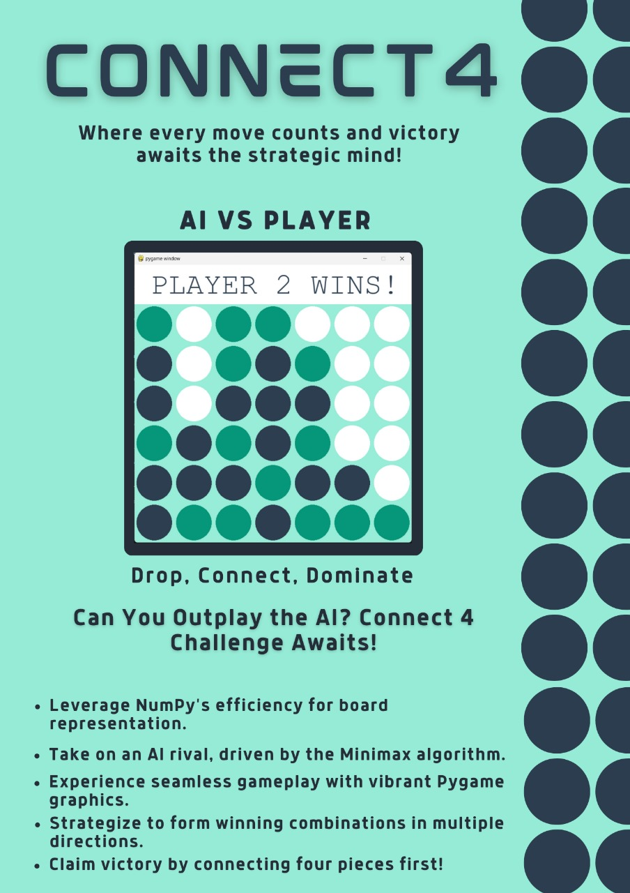

# CONNECT 4: AI vs YOU Edition

1. Challenge yourself against an AI opponent powered by the Minimax algorithm.
2. Enjoy vibrant graphics and smooth gameplay powered by Pygame.
3. Strategize your moves to create winning combinations vertically, horizontally, or diagonally.
4. Be the first to connect four pieces and claim victory!

## Features

- **Board Representation:** The game board is represented using a 2D NumPy array where each cell can hold a value representing the player piece or be empty.
- **Game Loop:** The game is controlled by a main loop that continues until the game is over. Inside the loop, events like mouse clicks are processed.
- **Player Interaction:** The game allows the player to interact via mouse clicks to select a column to drop their piece into.
- **AI Opponent:** The game includes an AI opponent that uses the Minimax algorithm to determine the best move to make. The Minimax algorithm recursively explores the game tree up to a certain depth, evaluating each possible move and selecting the one with the highest score. This process is done in turns, considering both the player's and the AI's potential moves.
- **Winning Conditions:** The game checks for winning conditions after each move. If a player achieves four pieces in a row horizontally, vertically, or diagonally, the game declares that player as the winner.
- **Graphics:** The game utilizes Pygame for graphics rendering. It draws the game board and updates the display accordingly with each move.
- **Scoring:** The AI evaluates the attractiveness of a board position using a scoring function. This function assigns scores to different board configurations based on the potential for winning.
- **Terminal Nodes:** The game checks for terminal nodes (win or draw) to determine when to stop evaluating moves.
- **End Game:** When the game is over, it displays a message indicating the winner and sets the `game_over` flag to true.
